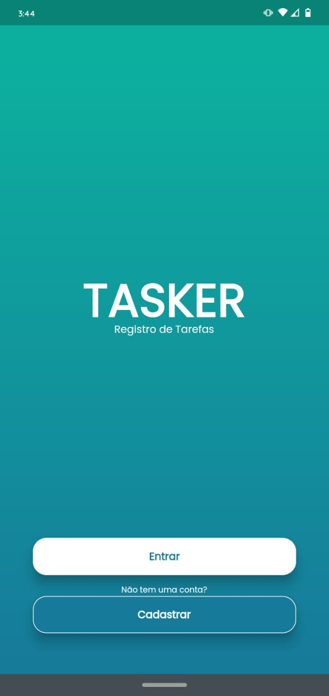
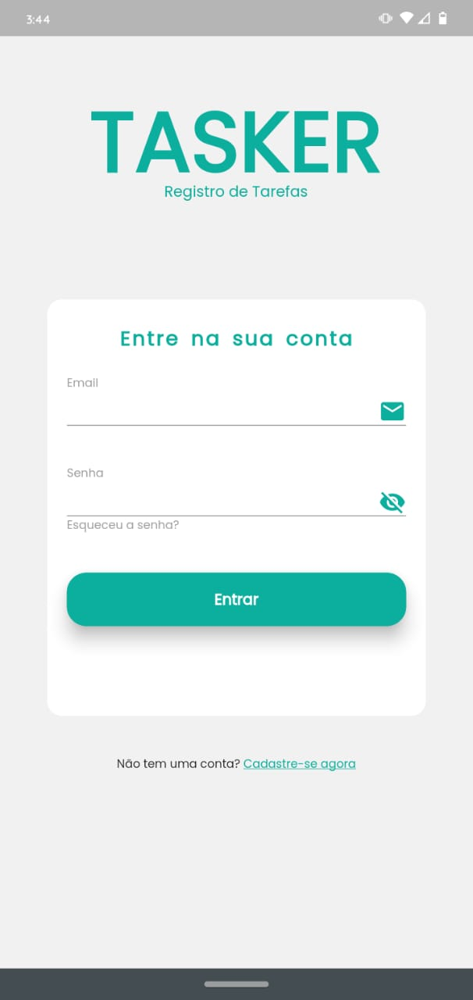
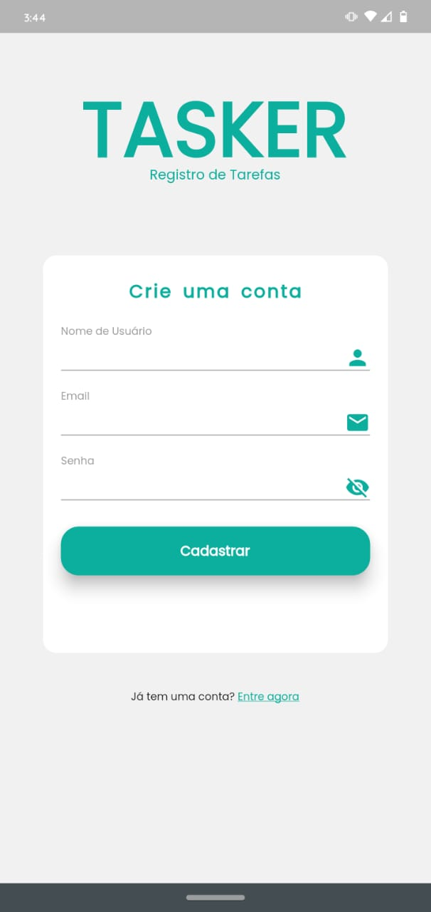
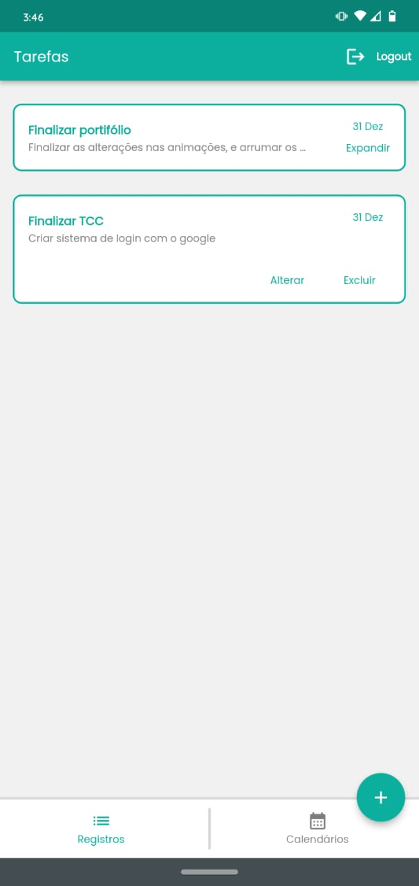
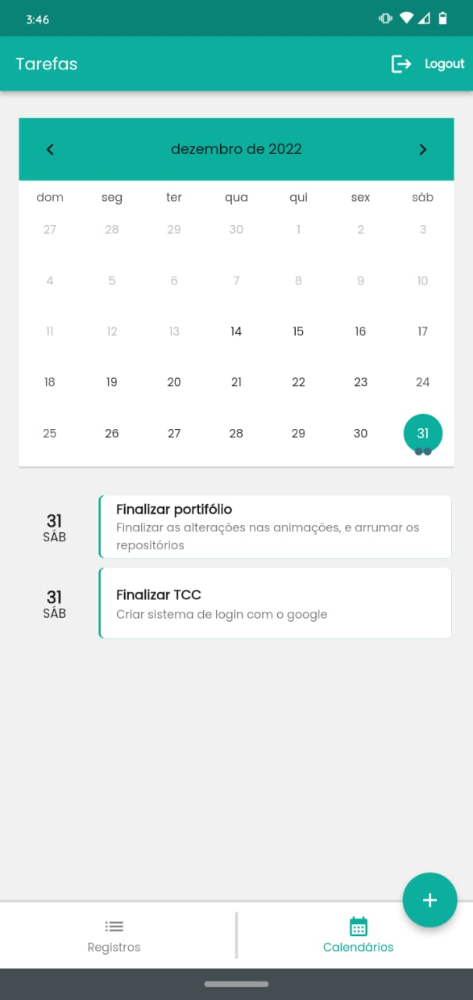

# Tasker

Projeto de Programação para dispositivos móveis desenvolvido no ultimo ano do ensino técnico no CEFET-MG (2022) durante as aulas, foi utilizado Flutter e Dart juntamente com o banco da dados FireBase

Orientador: Prof. Raulivan Rodrigo

## Preview

- ### Index

- ### Login

- ### Cadastro

- ### Home

- ### Calendário

